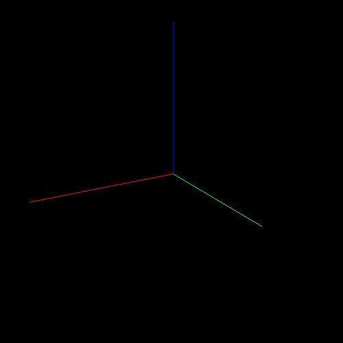
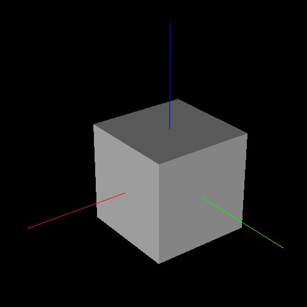
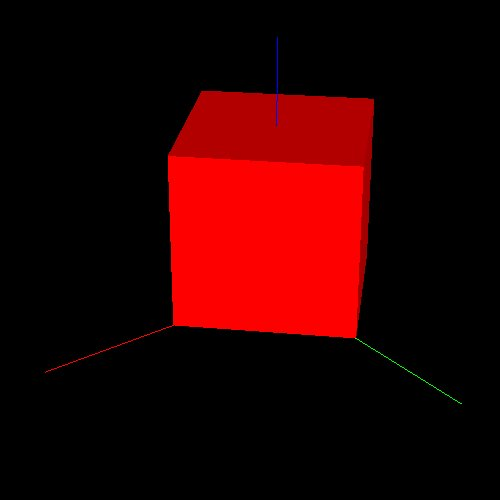
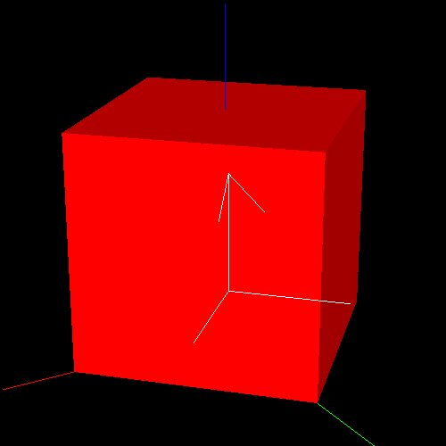
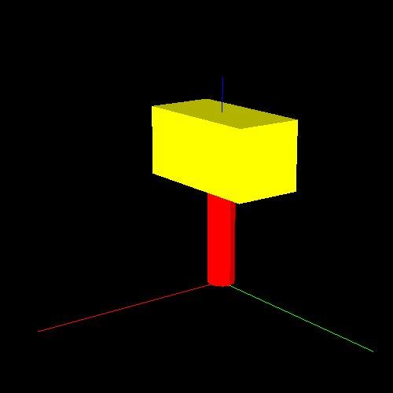
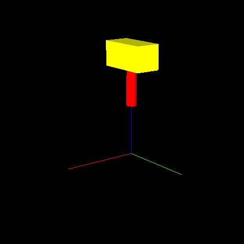

# Geometric Coding

euslispには幾何学計算ライブラリが豊富に含まれています．
roseusを含むirteusgl以降の拡張で使えるものについて解説します．


## 3Dビューワ

```
(make-irtviewer)
```

とすると，次のような3Dビューワが立ち上がります．



このビューワには`*irtviewer*`という変数でアクセスすることができます．
また中心付近をドラッグすることで視点の角度を，
左側，下側をドラッグすることで視点の位置を，
上側，右側をドラッグすることで拡大縮小をそれぞれ変更できます．
通常の3Dソフトに比べて独特なので注意してください．

ループを用いたプログラミングの際に必要となることとして，
描画の更新とイベントの処理があります．
描画の更新には，次のようにしてください．

```
(send *irtviewer* :draw-objects)
```

基本的に物体の情報を更新しただけでは描画は更新されないため，
クリックするか上のコマンドを使って更新します．
また，ループ中にもクリックやドラッグといったイベントを処理するためには，
次のようにしてください．

```
(x::window-main-one)
```


## 基本立体

```
(setq *cube* (make-cube 100 100 100))
```

とすると，一辺が100(単位はmm)の立方体が生成されます．
これをビューワに出すためには，
```
(objects (list *cube*))
```
としてください．




色を変えるためには，
```
(send *cube* :set-color :red)
```
とします．

```
(send *cube* :translate (float-vector 0 0 50))
(send *cube* :rotate (/ pi 4.0) :z)
```
とするとことで，平行移動，回転を行わせることができます．
ここで，`float-vector`はベクトルを作るための関数です．
ベクトルはリストではなく，同じ型の値しか内部に持つことができません．

ここまでの変更を加えると，次のようになります．
(表示を更新するにはビューワをクリックするか
`send *irtviewer* :draw-objects`してください．)




同様に，`make-cylinder`,`make-cone`などを作成することができます．
もっと詳しく知りたい場合は，
[基本bodyの作成関数]を参照してください．

[基本bodyの作成関数]: http://euslisp.github.io/jskeus/jmanual-node118.html


## ベクトル演算

単なるベクトルの計算をしたい時は，`v+`,`v-`,`v.`,`v*`を使います．

```
(setq *v0* (float-vector 1 2 3)
      *v1* (float-vector 4 5 6))
(print (v+ *v0* *v1*))
(print (v- *v0* *v1*))
(print (v. *v0* *v1*))  ;; 内積
(print (v* *v0* *v1*))  ;; 外積
```

定数倍を行いたい場合，
`scale`を用います．
```
(scale 10.0 *v0*)
```

また，ベクトルの要素には`elt`を使ってアクセスできますが，
`car`などリストだけで使える方法は使えません．

`float-vector`を使って作られたベクトルオブジェクトは`#f()`
となっています．
例えば，`#f(0 0 0)`などとすると即値でアクセスすることができますが，
**`#f()`でアクセスした場合，その中を書き換えてはいけない**
ことに注意してください．


## 座標系

続けて，
```
(send *cube* :coords)
```
としてみてください．
例えば，
```
#<coordinates #X6890ff8  0.0 0.0 50.0 / 0.785 0.0 0.0>
```
のようなオブジェクトが返ってきます．
これは`coordinate`というオブジェクトになっており，
同次座標変換を行うことのできるオブジェクトです．
先ほど立方体を動かしたメソッドは，
この`coordinate`に対する処理を行なっています．

座標系はオブジェクトなので，
コピーしたものを使いたい場合は
```
(send *cube* :copy-coords)
```
とするとコピーが作れます．

```
(setq *co* (make-coords))
```
とすると，新しい座標を作ることができます．

座標の平行移動は
```
(send *co* :translate (float-vector 10 20 30))
```
として行うことができます．

座標の回転移動は複数のやり方がありますが，
最も簡単には軸を指定して回転させます．
```
(send *co* :rotate (/ pi 4.0) :z)
```
とすると，z軸周りに4/PI(単位はラジアンなので，45度)回転することができます．
(`deg2rad`もしくは`rad2deg`をつかうとラジアンと度を相互変換できます．)

また，ビューワ上で座標を見ることができます．
```
(objects (list *cube* *co*))
```
としてみてください．




### 座標系を用いたベクトルの変換

座標系を用いて同次座標変換を行うことができます．

```
(setq *vec* (float-vector 100 0 50))
(send *co* :transform-vector *vec*)
```
とすると，`*co*`で`*vec*`を変換したベクトルが返ってきます．
```
#f(80.7107 90.7107 80.0)
```


### 座標系を用いた座標系動詞の変換

例えば，次のように入力してください．

```
(setq *co2* (make-coords))
(send *co2* :translate (float-vector 100 0 0))
(send *co2* :rotate pi :x)
(send *co* :transform *co2*)
```
返り値は，`*co*`を`*co2*`で変換したものになります．
`*co*`の値そのものが変化します．
```
#<coordinates #X68a8e38  80.711 90.711 30.0 / 0.785 6.163e-33 3.142>
```


## 連結座標系

これまでは単一の座標系を用いていましたが，
`cascaded-coords`を用いると，連結された座標系を表現できます．
つまり，親となる座標が動いた場合，子も一緒に動きます．
`make-coords`の代わりに，`make-cascoords`を使います．

```
(setq *casco* (make-cascoords))
(setq *casco2* (make-cascoords :pos (float-vector 100 0 0) :parent *casco*))
```
とすると，`*casco*`と`*casoco2*`は連結されます．
このように作成時に連結する他にも，
`:assoc`というメソッドも使えます．

```
(send *casco* :translate (float-vector 0 0 100))
;; 返り値は #<cascaded-coords #X690b528  0.0 0.0 100.0 / 0.0 0.0 0.0>
```
とすると，`*casco2*`も一緒に動きます．
```
*casco2*
;; とすると #<cascaded-coords #X6a0ece8  100.0 0.0 100.0 / 0.0 0.0 0.0>
```

ではためしに次のようにしてみましょう．
```
(send *casco2* :translate (float-vector 0 100 0))
;; #<cascaded-coords #X6a0ece8  100.0 100.0 100.0 / 0.0 0.0 0.0>
```
`*casco*`は動きません．
```
*casco*
;; #<cascaded-coords #X690b528  0.0 0.0 100.0 / 0.0 0.0 0.0>
```

## 立体の連結

では，次のようなことをしたらどうなるでしょうか，

```
(setq *stick* (make-cylinder 10 100))
(send *stick* :set-color :red)
(setq *body* (make-cube 50 100 50))
(send *body* :translate (float-vector 0 0 100))
(send *body* :set-color :yellow)
(send *stick* :assoc *body*)
(objects (list *body* *stick*))
```



二つの物体が表示されます．
この状態で`*stick*`を動かしてみると，
```
(send *stick* :translate (float-vector 0 0 100))
(send *irtviewer* :draw-objects)  ;; 表示の更新
```



二つの立体が一緒に移動します．立体同士も連結することができました．


一方，この状態だと，
```
(send *body* :coords)
;; #<coordinates #X6b3d9f8  0.0 0.0 100.0 / 0.0 0.0 0.0>
```
となり，最初に作った時のままです．
いま`*body*`は`#f(0 0 200)`の位置にいるはずなので，
これは局所座標系の値ではないかと推測されます．
世界座標系で連結を考慮した座標系を取ってくるには，
```
(send *body* :worldcoords)
;; #<coordinates #X6a93e88  0.0 0.0 200.0 / 0.0 0.0 0.0>
```
とします．

コピーを取ってくる場合は，
```
(send *body* :copy-worldcoords)
```
となります．


