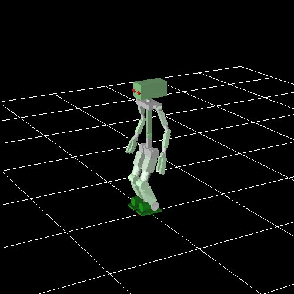
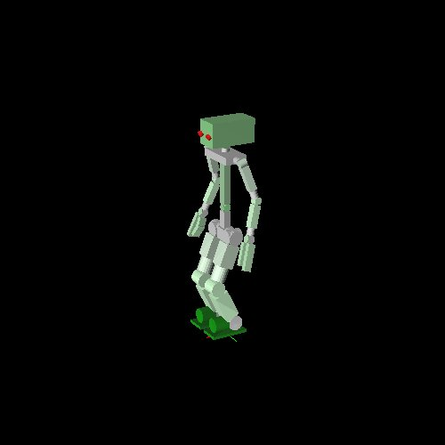
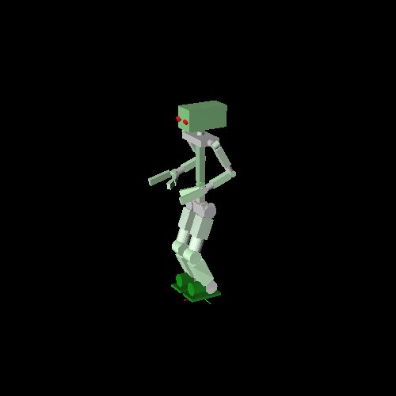
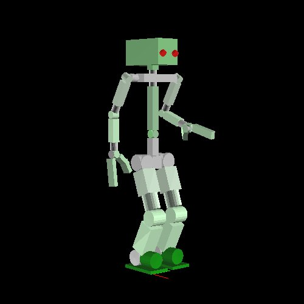
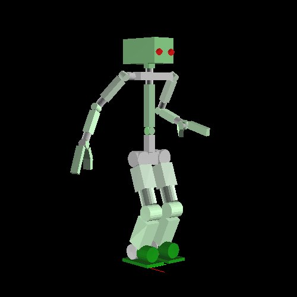
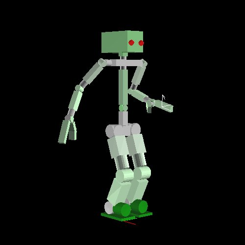
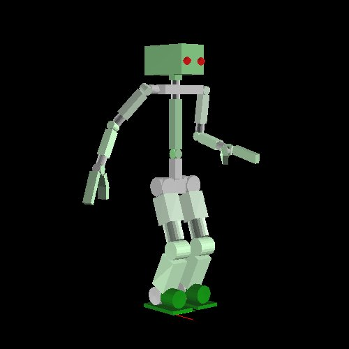
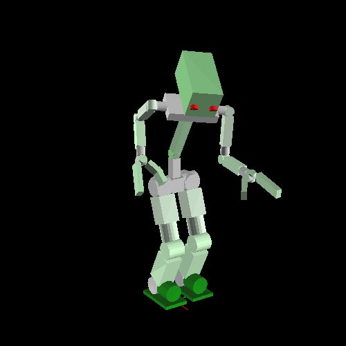
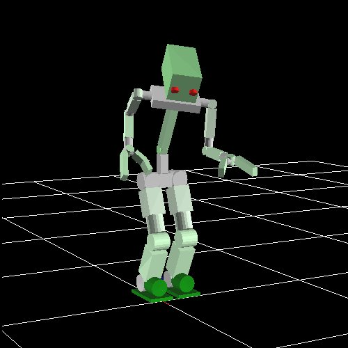
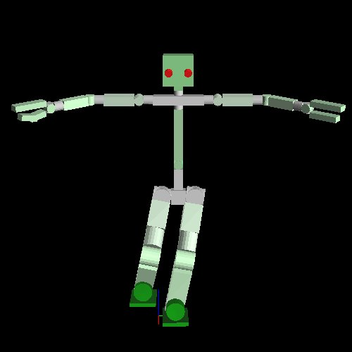

# Robot Coding

ここからeuslispを使ったロボットプログラミングに移ります．
ここでは`hrpsys_ros_bridge_tutorials`の中にある
`samplerobot`を題材に進めていきます．
`jsk_common`を用いてインストールした場合，すでにインストールされています．

ここでの説明は，
`hrpsys_ros_bridge`や`jsk_robot`のような
ロボットモデル，インタフェースの設計方法に則ったロボットであれば
**すべてのロボットで共通するものです．**
例えば以下の説明で`samplerobot`や`*sr*`となっている部分を
それぞれのロボットに置き換えることでそのまま利用することができます．


## サンプルロボットの起動

```bash
roscore
```
として，あらかじめroscoreを上げておきましょう．

別のターミナルに移り，
```bash
roscd hrpsys_ros_bridge_tutorials/euslisp
```
で，目的のディレクトリに移動できます．
移動できない場合はインストールが不完全なので，やり直してください．

```bash
emacs -nw
```
として，emacsを立ち上げ，`M-x shell`でemacs shellを起動します．

```bash
roseus samplerobot-interface.l
```

として，プロンプトが返ってくれば準備完了です．
```
(samplerobot-init)
```
してください．
しばらくすると，シミュレータのビューワが立ち上がります．



このシミュレータはeuslispのものではない事に注意してください．
もし実機を使う場合やgazeboのような別のシミュレータを使う場合，
この画面は表示されません．

ここで，ロボットのオブジェクトは`*sr*`に，
`*ri*`にはロボットのインタフェースが確保されています．

```
(objects (list *sr*))
```
とすると`irtviewer`が立ち上がり，euslispのロボットモデルが表示されます．
`irtviewer`はタイトルがIRT Viewerで，
背景にグリッドがないことで見分けてください．




## ロボットモデルを用いたプログラミング

### 定形ポーズ

各ロボットにはいくつかの定形ポーズがあります．

```
(send *sr* :reset-manip-pose)
```

とすると，両腕での作業に適したポーズを取ります．




```
(send *sr* :reset-pose)
```

は初期姿勢に戻ります．


### 各リムへのアクセス

例として，ロボットの右腕へは以下のようにアクセスできます．

```
(send *sr* :rarm)
```

以下のように，リンクのリストが返ってきます．

```
(#<bodyset-link #X7344798 RARM_LINK1  0.0 -210.0 1249.5 / 0.0 0.524 0.0> #<bodyset-link #X73367b0 RARM_LINK2  0.0 -210.0 1249.5 / 0.0 0.524 0.0> #<bodyset-link #X7309358 RARM_LINK3  -131.5 -210.0 1021.735 / 0.0 0.524 0.0> #<bodyset-link #X72ed1b8 RARM_LINK4  -131.5 -210.0 1021.735 / 0.0 -1.222 0.0> #<bodyset-link #X72b9da8 RARM_LINK5  100.604 -210.0 937.256 / 0.434 -1.189 -0.406> #<bodyset-link #X72a27e0 RARM_LINK6  100.604 -210.0 937.256 / 0.596 -1.29 -0.559> #<bodyset-link #X7253560 RARM_LINK7  100.604 -210.0 937.256 / 0.596 -1.29 0.078>)
```

その他の各リムへは以下のようにアクセスできます．

```
(send *sr* :head)  ;; samplerobotにはない
(send *sr* :larm)
(send *sr* :body)
(send *sr* :rleg)
(send *sr* :lleg)
```

当然，ロボットによって存在しないリムは`nil`を返します．
例えば車輪移動型ロボットでは左右の足は存在しません．

各リムがどのような関節を持っているかは，以下のように取得できます．

```
(send *sr* :rarm :joint-list)
```

この返り値は関節のリストになります．

```
(#<rotational-joint #X70a3cd8 RARM_SHOULDER_P> #<rotational-joint #X76107a0 RARM_SHOULDER_R> #<rotational-joint #X7610668 RARM_SHOULDER_Y> #<rotational-joint #X76105a8 RARM_ELBOW> #<rotational-joint #X7610470 RARM_WRIST_Y> #<rotational-joint #X76103b0 RARM_WRIST_P> #<rotational-joint #X7610278 RARM_WRIST_R>)
```

euslispからアクセスするときの名前は
各関節の名前からリム名を除き，`_`を`-`に換えたものになります．


### 順運動学

関節角度を直接変更します．
例えば右腕の肘の関節角度は次のように取得します．

```
(send *sr* :rarm :elbow-p :joint-angle)
```

関節角度は度で表されます．
これを変更するためには，変更後の値を引数として与えます．

```
(send *sr* :rarm :elbow-p :joint-angle -30.0)
```




このように順々に関節角度を変更することで任意の姿勢を取らせることができます．

```
(send *sr* :rarm :shoulder-r :joint-angle -30.0)
```




### 逆運動学

続いて逆運動学を解かせます．
逆運動学の基準となる座標は`end-coords`で取得できます．

```
(send *sr* :larm :end-coords)
```

とすることで，左手の基準座標を取得できます．
ビューワに一時的に座標を表示するためには，以下のようにします．

```
(send *sr* :larm :end-coords :draw-on :size 100.0 :flush t)
```



このとき，矢印が向いている方向がZ軸になります．
この座標系をコピーして移動させ，その位置に手を伸ばさせます．

```
(setq *larm-end* (send *sr* :larm :end-coords :copy-worldcoords))
(send *larm-end* :translate (float-vector 100.0 0.0 10.0))
(send *sr* :larm :inverse-kinematics *larm-end*)
```



この例では，基準座標が目標座標と完全に一致するように逆運動学を解きます．
一方で，例えばペットボトルのような円柱をつかむときには
Z軸周りの回転は任意でよい，ということも考えられます．
この場合，`:rotation-axis`というキーワード引数を使います．
`t`がデフォルトで全軸を完全に一致させます．
`:z`の場合Z軸周りは任意になります．
`nil`を渡すと回転は無視されます．

```
(send *larm-end* :translate (float-vector 100.0 0.0 50.0))
(send *sr* :larm :inverse-kinematics *larm-end* :rotation-axis :z)
```

また，`:move-end-pos`を使って簡単に平行移動させることができます．
この時与えるベクトルは`end-coords`基準であることに注意してください．

```
(send *sr* :larm :move-end-pos (float-vector 0 0 100))
```

上の三つの例は，腕だけを動かす例です．
上半身をあわせて使うことで可動域を広げることができます．
上半身を使うためには，`:torso t`とする他に
`:link-list`に計算に使うリンクをすべて渡す必要があります．

```
(send *sr* :reset-manip-pose)
(setq *larm-end* (send *sr* :larm :end-coords :copy-worldcoords))
(send *larm-end* :translate (float-vector 400.0 -50.0 50.0))
(send *sr* :larm :inverse-kinematics *larm-end*
	    :rotation-axis t :torso t
	    :link-list
      (send *sr* :link-list
            (send *sr* :larm :end-coords :parent)
            (car (send *sr* :torso :links))))
```




## ロボットとの通信

ロボットと通信するためには，`*ri*`を使います．
これは実機の場合には実機と，シミュレータの場合はシミュレータと接続されます．

関節角度をロボットに同期させるためには以下のようにします．

```
(send *ri* :angle-vector (send *sr* :angle-vector) 2000)
```

このようにすると，ロボットは2000ms後に目標姿勢に移動します．



姿勢移動は非同期的に行われるため，
移動が終わるのを同期したい場合は以下のようにします．

```
(send *ri* :wait-interpolation)
```

また，ロボットの姿勢をモデル側に取得するためには
以下のようにします．

```
(send *ri* :state)
(send *sr* :angle-vector (send *ri* :potentio-vector))
```

## 足の使い方

ロボットを特定のスポットに移動するには，`:fix-leg-to-coords`を使います．

```
(send *sr* :fix-leg-to-coords (make-coords) :both)
```

ここで最後の`:both`は両足の中心を所定の座標に移動するという意味で．
`:rleg`, `:lleg`を指定するとそれぞれの足の中心が基準となります．

二足歩行ロボットの場合，静的にバランスを計算し，
重心が支持多角形の中心に来るように足を動かすことができます．

```
(send *sr* :reset-pose)
(send *sr* :rarm :shoulder-r :joint-angle -90)
(send *sr* :larm :shoulder-r :joint-angle 90)
(send *sr* :rleg :move-end-pos (float-vector 0 -100 100))
(send *sr* :move-centroid-on-foot :lleg '(:lleg))
```



この例では，左足の上に重心が来るように，左足を動かしています．
`:move-centroid-on-foot`の第一引数はどの足の上に重心を動かすかを指定し，
第二引数はどの足を動かすかをリストで与えます．
